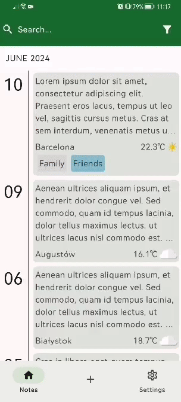

# Diary App

A diary app allows users to write and store personal journal entries.

App was built with: 
* Kotlin
* Jetpack Compose
* Sql Delight
* DataStore
* Hilt
* Ktor Client
* Play Location Services
* Google Maps SDK
* Maxkeppeler Caledar and Clock

Features:

 * **Local Storage:** Store your notes securely on your device.
 * **Weather Info:** Get current weather information for your area.
 * **Location Settings:** Set a default location for weather updates via Google Maps if you prefer not to share your location.
 * **Daily Reminders:** Receive notifications reminding you to post a memory every day.
 * **Filtering:** Filter your notes by dates and categories for easy organization.
 * **Search Function:** Search for your notes quickly using the search bar.

## Adding and Storing Notes

While adding new note You can: 

* select categories from prepared list
* select custom date in case You missed to add note
* get weather info from Your location (if You selected default location, app does it for You)

  

  If You add note before the time daily reminder was set, notification won't show up (more about it in Daily Reminder Section)


### To store notes locally on Your device app uses Sql Delight library.
  Database schema includes 2 relations:
  * one to one relation between **Note** and **WeatherInfo**
  * and many to many relations between **Category** and **Note**
 
    As it is shown below
  
  


I created one **View** to simplify queries
  ```sql
    CREATE VIEW IF NOT EXISTS note_view AS
    SELECT
        noteEntity.id AS note_id,
        noteEntity.description AS note_content,
        noteEntity.timestamp AS timestamp,
        noteEntity.weather_id AS weather_id,
        noteEntity.location AS location,
        weatherEntity.temperature AS temperature,
        weatherEntity.weather_type AS weather_type,
        categoryEntity.id AS category_id,
        categoryEntity.background_color AS bg_color,
        categoryEntity.name AS category_name
    FROM
        noteEntity
    LEFT JOIN
        weatherEntity ON noteEntity.weather_id = weatherEntity.id
    LEFT JOIN
        notes_categories ON noteEntity.id = notes_categories.note_id
    LEFT JOIN
          categoryEntity ON notes_categories.category_id = categoryEntity.id;
  ```
  [SQL schema with queries](https://github.com/nowiczenkoandrzej/DiaryApp/blob/master/app/src/main/sqldelight/diaryapp/db/noteEntity.sq)

## Weather Info

App collects weather info about current temperature and weather type from [Open Meteo Api](https://open-meteo.com/)

Api request needs latitude and longitude as parameters. They are provided by **FusedLocationProvider** or default location chosen by user in settings.

## Location Settings

You can set default location in settings by clicking button that localize you or select location via **Google Maps**


While You adding new note and You are in diferent place than default location is set on, You can always get current location in adding note screen just by clicking button.

App also uses **Geocoder** to get Your current or chosen location city name.

## Daily Reminders

App allows you set **Notifications** that reminds You to post note. All You have to do is to select hour at which you want to be reminded.

```kotlin

    alarmManager.setRepeating(
        AlarmManager.RTC_WAKEUP,
        item.time.atZone(ZoneId.systemDefault()).toEpochSecond() * 1000,
        AlarmManager.INTERVAL_DAY,
        PendingIntent.getBroadcast(
            context,
            hashCode,
            intent,
            PendingIntent.FLAG_UPDATE_CURRENT or PendingIntent.FLAG_IMMUTABLE
        )
    )

```

Also if You already added note before notification it won't show up today.
App saves in **DataStore Preferences** information about adding note.
AlarmManager doesn't cancel existing alarm, it still works in background but notification won't show due to condition shown below


```kotlin

      val hasNoteBeenAddedToday = notificationPreferencesRepository.getIsNoteAdded() ?: false

      if(!hasNoteBeenAddedToday) {
            val activityIntent = Intent(context, MainActivity::class.java)

            val intent = PendingIntent.getActivity(
                context,
                1,
                activityIntent,
                if(Build.VERSION.SDK_INT >= Build.VERSION_CODES.M) PendingIntent.FLAG_IMMUTABLE else 0
            )

            val notification = NotificationCompat.Builder(context, NOTIFICATION_CHANNEL_ID)
                .setSmallIcon(R.drawable.baseline_menu_book_24)
                .setContentTitle("Create New Note")
                .setContentText("")
                .setContentIntent(intent)
                .setAutoCancel(true)
                .build()

            notificationManager.notify(
                1,
                notification
            )

            Log.d("TAG", "showNotification: notification shown")
        } else {
            notificationPreferencesRepository.setIsNoteAdded(false)
            Log.d("TAG", "showNotification: notification didnt show up")
        }
    }
```

## Custom Components

In note details screen app uses collected weather info to choose background and dislpay temperature.




